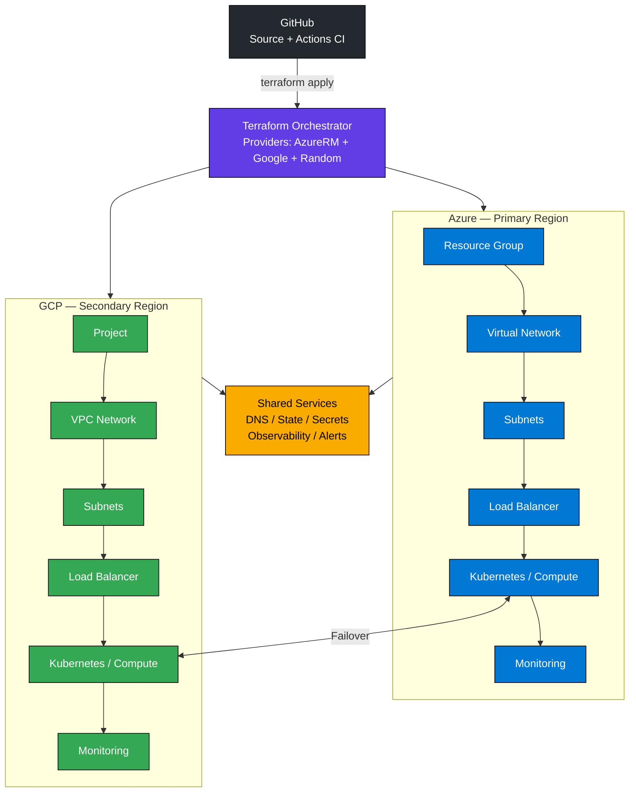
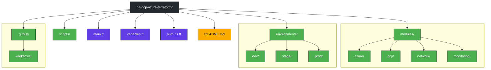

# ha-gcp-azure-terraform

# HA Multi-Cloud Infrastructure on Azure + GCP using Terraform

> Production-ready reference architecture for deploying highly available infrastructure across Microsoft Azure and Google Cloud Platform using Terraform.

---

## Architecture




## Overview

This repository provisions a multi-cloud, highly available infrastructure topology across Azure and GCP using Terraform.

### Objectives

- High availability across cloud providers
- Infrastructure as Code (IaC)
- Automated deployment pipelines
- Disaster recovery readiness
- Cost visibility
- Secure-by-default configuration

---

## Features

- Multi-cloud deployment (Azure + GCP)
- Terraform modular architecture
- GitHub Actions integration
- Failover-ready topology
- Monitoring and observability
- Secure secrets handling
- Environment isolation

---

## Repository Structure




---

## Prerequisites

- Terraform >= 1.8
- Azure subscription
- GCP project
- GitHub repository secrets
- Azure CLI
- Google Cloud SDK

---

## Quick Start

### Initialize

```bash
terraform init
```

### Validate

```bash
terraform fmt -recursive
terraform validate
```

### Preview

```bash
terraform plan
```

### Deploy

```bash
terraform apply
```

### Destroy

```bash
terraform destroy
```

---

## Deployment Flow

```text
Commit
 ↓
GitHub Actions
 ↓
Terraform Validate
 ↓
Terraform Plan
 ↓
Approval
 ↓
Terraform Apply
 ↓
Azure + GCP Deployment
 ↓
Health Checks
 ↓
Monitoring + Alerts
```

---

## Variables

| Variable | Description |
|---|---|
| azure_region | Azure deployment region |
| gcp_region | GCP deployment region |
| environment | Environment name |
| instance_count | Compute replicas |

---

## Outputs

| Output | Description |
|---|---|
| cluster_endpoint | Service endpoint |
| public_ip | Public ingress |
| monitoring_url | Monitoring dashboard |

---

## Failover Strategy

- Active / Passive topology
- Health probes
- DNS redirection
- Terraform state recovery

---

## Security

- Remote state protection
- Secret isolation
- Least privilege access
- Environment separation

---

## Monitoring

Suggested stack:

- Prometheus
- Grafana
- Cloud-native monitoring
- Alerting

---

## Cost Estimation

Track:

- Compute
- Networking
- Storage
- Monitoring
- Egress

---

## Troubleshooting

Common commands:

```bash
terraform state list
terraform plan
terraform refresh
```

---

## Roadmap

- Kubernetes support
- Cross-region replication
- Autoscaling
- Cost optimization
- Policy as code

---

## License

MIT
## 🧪 Local Development & Cloudless Testing

This repository supports **local execution and infrastructure validation without provisioning resources in Azure or Google Cloud**.

The goal of this mode is to enable:

- Local Terraform validation
- Development without cloud costs
- CI/CD smoke testing
- Module testing
- Kubernetes integration testing
- Faster feedback loops
- Offline experimentation

Instead of deploying to cloud providers, local emulators and compatible services are used.

---

## Architecture Overview

```text
Developer Machine
│
├── Docker Compose
│
├── Terraform
│
├── Local Cloud Emulators
│   │
│   ├── Azure Layer
│   │     ├── Azurite (Storage)
│   │     └── Kind (AKS replacement)
│   │
│   └── GCP Layer
│         ├── Fake GCS
│         ├── Pub/Sub Emulator
│         └── Firestore Emulator
│
├── Kubernetes (Kind)
│
└── Local Terraform Backend
```

---

## Supported Services

| Cloud Provider | Cloud Service | Local Replacement |
|---|---|---|
| Azure | Storage Account | Azurite |
| Azure | AKS | Kind |
| GCP | Cloud Storage | Fake GCS |
| GCP | Pub/Sub | Pub/Sub Emulator |
| GCP | Firestore | Firestore Emulator |
| Any | Terraform Backend | Local Backend |

> This environment is intended for development and validation. It is not a full cloud emulator.

---

## Prerequisites

Install the following tools:

### Required

- Docker
- Docker Compose
- Terraform >= 1.8
- kubectl
- Kind

Verify:

```bash
docker --version
terraform --version
kubectl version --client
kind version
```

---

## Clone Repository

```bash
git clone https://github.com/mjpinot/ha-gcp-azure-terraform

cd ha-gcp-azure-terraform
```

---

## Create Local Environment

Create:

```text
local/docker-compose.local.yml
```

```yaml
services:

  azurite:
    image: mcr.microsoft.com/azure-storage/azurite
    restart: unless-stopped

    ports:
      - "10000:10000"

  fake-gcs:
    image: fsouza/fake-gcs-server

    command:
      - -scheme
      - http

    ports:
      - "4443:4443"

  pubsub:
    image: messagebird/gcloud-pubsub-emulator

    ports:
      - "8681:8681"

  firestore:
    image: mtlynch/firestore-emulator

    ports:
      - "8080:8080"
```

Start services:

```bash
docker compose \
-f local/docker-compose.local.yml \
up -d
```

Validate:

```bash
docker ps
```

---

## Create Local Kubernetes Cluster

Start a local Kubernetes cluster:

```bash
kind create cluster \
--name ha-local
```

Verify:

```bash
kubectl get nodes
```

Expected:

```text
NAME
ha-local-control-plane
```

---

## Configure Terraform Local Backend

Create:

```text
local/backend.local.tf
```

```hcl
terraform {

  backend "local" {
    path = "./terraform.tfstate"
  }

}
```

Initialize:

```bash
terraform init
```

---

## Configure Local Environment Variables

Create:

```text
local/.env.local
```

```bash
USE_LOCALSTACK=true

AZURE_STORAGE_ENDPOINT=http://localhost:10000

GCS_ENDPOINT=http://localhost:4443

PUBSUB_EMULATOR_HOST=localhost:8681

FIRESTORE_EMULATOR_HOST=localhost:8080
```

Load variables:

### Linux / macOS

```bash
export $(cat local/.env.local | xargs)
```

### Windows PowerShell

```powershell
Get-Content local/.env.local |
foreach {
  $name,$value=$_.split('=')
  set-item env:$name $value
}
```

---

## Validate Terraform

Format:

```bash
terraform fmt
```

Validate:

```bash
terraform validate
```

Preview:

```bash
terraform plan
```

Expected:

```text
No cloud resources created
```

---

## Apply Locally

```bash
terraform apply \
-auto-approve
```

Verify:

```bash
kubectl get all
```

---

## Cleanup

Destroy infrastructure:

```bash
terraform destroy \
-auto-approve
```

Delete cluster:

```bash
kind delete cluster \
--name ha-local
```

Stop emulators:

```bash
docker compose \
-f local/docker-compose.local.yml \
down
```

---

## CI/CD Example

Create:

```text
.github/workflows/local-validation.yml
```

```yaml
name: Local Validation

on:

  pull_request:

jobs:

  terraform:

    runs-on: ubuntu-latest

    steps:

      - uses: actions/checkout@v4

      - uses: hashicorp/setup-terraform@v3

      - name: Start Local Services
        run: |
          docker compose \
          -f local/docker-compose.local.yml \
          up -d

      - name: Init
        run: terraform init

      - name: Validate
        run: terraform validate

      - name: Plan
        run: terraform plan
```

---

## Recommended Repository Structure

```text
ha-gcp-azure-terraform/

├── local/
│   ├── docker-compose.local.yml
│   ├── backend.local.tf
│   └── .env.local
│
├── modules/
│
├── environments/
│
├── terraform/
│
└── README.md
```

---

## Notes

- Terraform provider authentication may still require mocked credentials depending on provider implementation.
- Some managed cloud services cannot be fully emulated.
- Kubernetes behavior may differ from managed clusters.
- Recommended usage: validate locally → deploy to real cloud.

## 🧪 Local Development & Cloudless Testing

This repository supports **local execution and infrastructure validation without provisioning resources in Azure or Google Cloud**.

The goal of this mode is to enable:

- Local Terraform validation
- Development without cloud costs
- CI/CD smoke testing
- Module testing
- Kubernetes integration testing
- Faster feedback loops
- Offline experimentation

Instead of deploying to cloud providers, local emulators and compatible services are used.

---

## Architecture Overview

```text
Developer Machine
│
├── Docker Compose
│
├── Terraform
│
├── Local Cloud Emulators
│   │
│   ├── Azure Layer
│   │     ├── Azurite (Storage)
│   │     └── Kind (AKS replacement)
│   │
│   └── GCP Layer
│         ├── Fake GCS
│         ├── Pub/Sub Emulator
│         └── Firestore Emulator
│
├── Kubernetes (Kind)
│
└── Local Terraform Backend
```

---

## Supported Services

| Cloud Provider | Cloud Service | Local Replacement |
|---|---|---|
| Azure | Storage Account | Azurite |
| Azure | AKS | Kind |
| GCP | Cloud Storage | Fake GCS |
| GCP | Pub/Sub | Pub/Sub Emulator |
| GCP | Firestore | Firestore Emulator |
| Any | Terraform Backend | Local Backend |

> This environment is intended for development and validation. It is not a full cloud emulator.

---

## Prerequisites

Install the following tools:

### Required

- Docker
- Docker Compose
- Terraform >= 1.8
- kubectl
- Kind

Verify:

```bash
docker --version
terraform --version
kubectl version --client
kind version
```

---

## Clone Repository

```bash
git clone https://github.com/mjpinot/ha-gcp-azure-terraform

cd ha-gcp-azure-terraform
```

---

## Create Local Environment

Create:

```text
local/docker-compose.local.yml
```

```yaml
services:

  azurite:
    image: mcr.microsoft.com/azure-storage/azurite
    restart: unless-stopped

    ports:
      - "10000:10000"

  fake-gcs:
    image: fsouza/fake-gcs-server

    command:
      - -scheme
      - http

    ports:
      - "4443:4443"

  pubsub:
    image: messagebird/gcloud-pubsub-emulator

    ports:
      - "8681:8681"

  firestore:
    image: mtlynch/firestore-emulator

    ports:
      - "8080:8080"
```

Start services:

```bash
docker compose \
-f local/docker-compose.local.yml \
up -d
```

Validate:

```bash
docker ps
```

---

## Create Local Kubernetes Cluster

Start a local Kubernetes cluster:

```bash
kind create cluster \
--name ha-local
```

Verify:

```bash
kubectl get nodes
```

Expected:

```text
NAME
ha-local-control-plane
```

---

## Configure Terraform Local Backend

Create:

```text
local/backend.local.tf
```

```hcl
terraform {

  backend "local" {
    path = "./terraform.tfstate"
  }

}
```

Initialize:

```bash
terraform init
```

---

## Configure Local Environment Variables

Create:

```text
local/.env.local
```

```bash
USE_LOCALSTACK=true

AZURE_STORAGE_ENDPOINT=http://localhost:10000

GCS_ENDPOINT=http://localhost:4443

PUBSUB_EMULATOR_HOST=localhost:8681

FIRESTORE_EMULATOR_HOST=localhost:8080
```

Load variables:

### Linux / macOS

```bash
export $(cat local/.env.local | xargs)
```

### Windows PowerShell

```powershell
Get-Content local/.env.local |
foreach {
  $name,$value=$_.split('=')
  set-item env:$name $value
}
```

---

## Validate Terraform

Format:

```bash
terraform fmt
```

Validate:

```bash
terraform validate
```

Preview:

```bash
terraform plan
```

Expected:

```text
No cloud resources created
```

---

## Apply Locally

```bash
terraform apply \
-auto-approve
```

Verify:

```bash
kubectl get all
```

---

## Cleanup

Destroy infrastructure:

```bash
terraform destroy \
-auto-approve
```

Delete cluster:

```bash
kind delete cluster \
--name ha-local
```

Stop emulators:

```bash
docker compose \
-f local/docker-compose.local.yml \
down
```

---

## CI/CD Example

Create:

```text
.github/workflows/local-validation.yml
```

```yaml
name: Local Validation

on:

  pull_request:

jobs:

  terraform:

    runs-on: ubuntu-latest

    steps:

      - uses: actions/checkout@v4

      - uses: hashicorp/setup-terraform@v3

      - name: Start Local Services
        run: |
          docker compose \
          -f local/docker-compose.local.yml \
          up -d

      - name: Init
        run: terraform init

      - name: Validate
        run: terraform validate

      - name: Plan
        run: terraform plan
```

---

## Recommended Repository Structure

```text
ha-gcp-azure-terraform/

├── local/
│   ├── docker-compose.local.yml
│   ├── backend.local.tf
│   └── .env.local
│
├── modules/
│
├── environments/
│
├── terraform/
│
└── README.md
```

---

## Notes

- Terraform provider authentication may still require mocked credentials depending on provider implementation.
- Some managed cloud services cannot be fully emulated.
- Kubernetes behavior may differ from managed clusters.
- Recommended usage: validate locally → deploy to real cloud.

